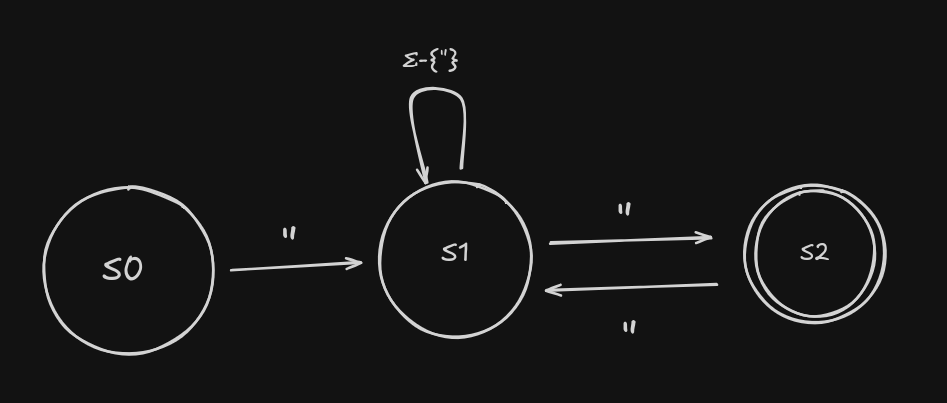
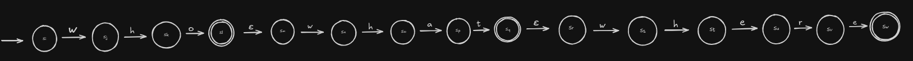
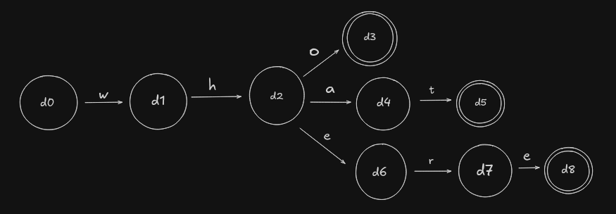
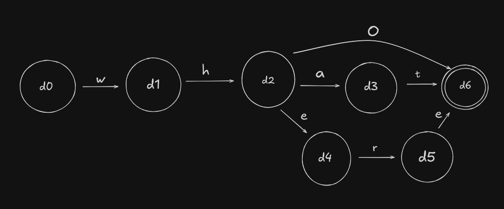
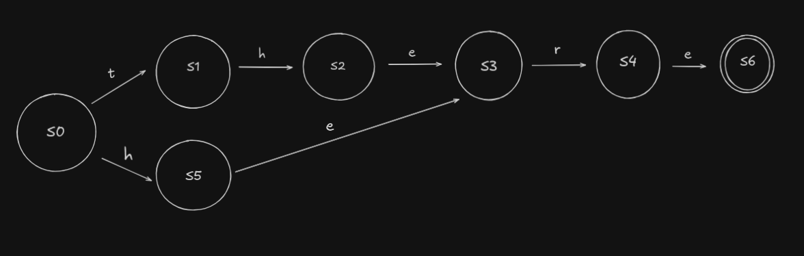

# Capitulo 2 - Scanners

## Questoes de revisao

Construa um FA para aceitar cada uma das seguintes linguagens:

## Questao 1

### Enunciado

Um identificador de seis caracteres consistindo de um caractere alfabetico seguido por zero a cinco caracteres alfanumericos.

### Resposta

## Questao 2

### Enunciado

Uma string de um ou mais pares, na qual cada par consiste em um abre-parenteses seguido por um fecha-parenteses.

### Resposta

## Questao 3

### Enunciado

Um comentario em Pascal, que consiste em uma abre-chaves, {, seguida por zero ou mais caracteres retirados a partir de um alfabeto, O, seguido por uma fecha-chaves, }.

### Resposta

---

## Questoes de revisao (RE e FA)

## Questao 4

### Enunciado

Lembre-se da RE para um identificador de seis caracteres, escrita usando um fechamento finito.

Reescreva-a em termos das suas tres operacoes basicas: alternacao, concatenacao e fechamento.

### Resposta

#### RE

Definindo `L = ([A...Z] | [a...z])` e `D = ([A...Z] | [a...z] | [0...9])`, a reescrita usando apenas alternacao, concatenacao e fechamento fica:

`L(D | e)(D | e)(D | e)(D | e)(D | e)`

Forma equivalente:

`L(e | D | DD | DDD | DDDD | DDDDD)`

## Questao 5

### Enunciado

Em PL/I, o programador pode inserir aspas em uma string escrevendo duas aspas em seguida.

Crie uma RE e um FA para reconhecer strings em PL/I. Suponha que as strings comecem e terminem com aspas e contenham apenas simbolos retirados de um alfabeto, designado como O. As aspas sao o unico caso especial.

### Resposta

#### RE

`"(Σ-{"} | "")*"`

#### FA

---

## Questões de Revisão

### Questão 6

#### Enunciado

Considere a RE `who | what | where`. Use a construção de Thompson para montar um NFA a partir da RE. Use a construção de subconjunto para montar um DFA a partir do NFA. Minimize o DFA.

#### Resposta

##### NFA de Thompson

##### DFA (Construção de Subconjunto)

##### DFA Minimizado

### Questão 7

#### Enunciado

Minimize o seguinte DFA:

#### Resposta

