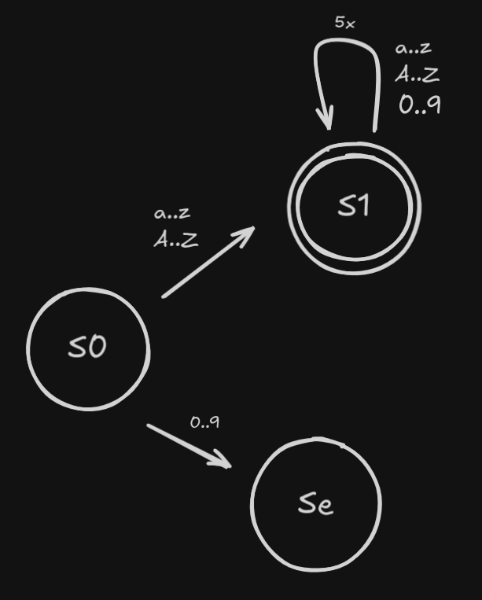
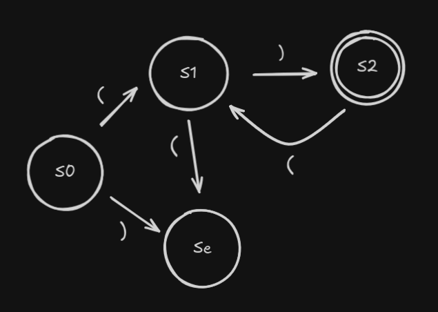
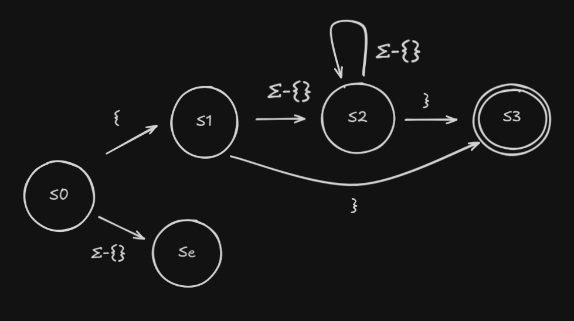

# Capitulo 2 - Scanners

## Questoes de revisao

Construa um FA para aceitar cada uma das seguintes linguagens:

## Questao 1

### Enunciado

Um identificador de seis caracteres consistindo de um caractere alfabetico seguido por zero a cinco caracteres alfanumericos.

### Resposta

## Questao 2

### Enunciado

Uma string de um ou mais pares, na qual cada par consiste em um abre-parenteses seguido por um fecha-parenteses.

### Resposta

## Questao 3

### Enunciado

Um comentario em Pascal, que consiste em uma abre-chaves, {, seguida por zero ou mais caracteres retirados a partir de um alfabeto, O, seguido por uma fecha-chaves, }.

### Resposta

